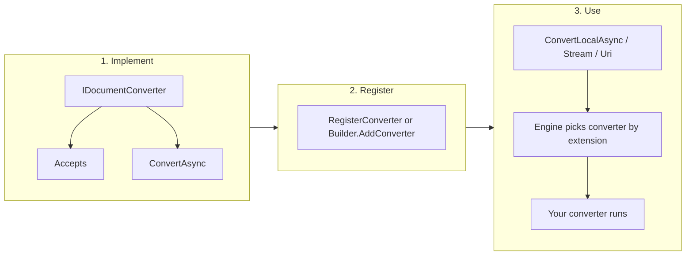

# Markitdown.CSharp

> **Convert any document to Markdown in .NET** — Word, Excel, PDF, PowerPoint, HTML, RTF, images (with optional OCR) and more. A community **MIT-licensed** implementation for C#, multi-targeting .NET 8, 9 and 10, with extensible converters and dependencies under MIT or Apache 2.0 (see [DEPENDENCIES-LICENSE.md](DEPENDENCIES-LICENSE.md)).

This library offers a single API for local files, streams and URLs; built-in support for Office, PDF, HTML, RTF and images (including Tesseract OCR); and a pluggable converter model so you can add custom formats without forking. No vendor lock-in, no external services required for core conversions.

---

## Why this package

- **MIT license** — use in closed-source and commercial projects without legal friction.
- **Multi-target** — one package for .NET 8, 9 and 10; the right build is selected automatically.
- **Wide format coverage** — DOCX, XLSX, XLS, PPTX, PDF, HTML, RTF, images (with OCR), CSV, EPUB, MSG, Jupyter, plain text and more, with a single `ConvertLocalAsync` / `ConvertStreamAsync` / `ConvertUriAsync` API.
- **Extensible** — implement `IDocumentConverter`, register your converter, and the engine routes by extension or MIME type.
- **Tested in real use** — conversions for the formats listed below are exercised with sample files and continuous validation.

---

## File format status

### Tested formats

These extensions have been verified with sample files and are part of the regular conversion pipeline:

| Format   | Extensions   | Notes |
|----------|--------------|--------|
| Word     | `.docx`      | ECMA and ISO OOXML namespaces; tables; Open XML SDK + fallback. |
| Excel    | `.xlsx`, `.xls` | Sheets to markdown tables. |
| PowerPoint | `.pptx`    | Slide text and structure. |
| PDF      | `.pdf`       | Text extraction with layout (lines, spacing). |
| HTML     | `.html`, `.htm` | HTML to markdown (ReverseMarkdown). |
| RTF      | `.rtf`       | RTF → HTML → markdown (RtfPipe). |
| Images   | `.png`, `.jpg`, `.jpeg` | Metadata; optional **Tesseract OCR** for text. |
| Plain text | `.txt`, `.md`, `.json`, `.jsonl` | Pass-through or charset detection. |

### Untested but possibly compatible

These formats are supported by built-in converters but are not part of the standard test set. Behavior may vary with real-world files:

| Format   | Extensions   | Notes |
|----------|--------------|--------|
| E-books  | `.epub`      | EPUB package extraction. |
| Email    | `.msg`       | Outlook MSG (MsgReader). |
| Notebooks| `.ipynb`     | Jupyter notebook cells. |
| Data     | `.csv`       | CSV to markdown table. |
| Archives | `.zip`       | Extracts and converts contents. |
| Audio    | (via converter) | Optional transcription service. |
| Web/special | URLs, RSS, Wikipedia, YouTube, Bing SERp | Dedicated converters when URL is passed. |

---

## Basic usage

### Install

```bash
dotnet add package Markitdown.CSharp
```

### Convert a local file

```csharp
using MarkItDown.CSharp;

using var markItDown = new MarkItDown();
var result = await markItDown.ConvertLocalAsync("document.docx");
Console.WriteLine(result.Markdown);
```

### Convert and save to disk

```csharp
using var markItDown = new MarkItDown();
var result = await markItDown.ConvertLocalAsync("report.xlsx");
await File.WriteAllTextAsync("report.md", result.Markdown);
```

### Convert from URL

```csharp
using var markItDown = new MarkItDown();
var result = await markItDown.ConvertUriAsync("https://example.com/page.html");
Console.WriteLine(result.Title);
Console.WriteLine(result.Markdown);
```

### Convert from stream (e.g. upload)

```csharp
await using var fileStream = File.OpenRead("document.pdf");
using var markItDown = new MarkItDown();
var result = await markItDown.ConvertStreamAsync(fileStream,
    new StreamInfo { FileName = "document.pdf", Extension = ".pdf" });
// Use result.Markdown
```

---

## Usage with Tesseract (OCR)

To extract text from images, Tesseract language data (e.g. `eng.traineddata`) must be available in a folder named `tessdata`. Use either the [Tesseract installer](https://github.com/UB-Mannheim/tesseract/wiki) layout or download [tessdata](https://github.com/tesseract-ocr/tessdata) / [tessdata_fast](https://github.com/tesseract-ocr/tessdata_fast) and place the `tessdata` folder somewhere. The path you configure is the **parent** of that `tessdata` folder.

### In code

Pass the parent of `tessdata` via `MarkItDownOptions`:

```csharp
var options = new MarkItDownOptions
{
    TesseractTessDataPath = @"C:\Program Files\Tesseract-OCR",  // or e.g. t:\tools\Tesseract-OCR
    TesseractLang = "eng",  // optional; default is "eng"
};
using var markItDown = new MarkItDown(options);
var result = await markItDown.ConvertLocalAsync("screenshot.png");
// result.Markdown includes "### Text in image (OCR)" when OCR runs
```

For stream/URL conversions, the same options are applied via the engine; you can also pass `tesseract_tessdata_path` and `tesseract_lang` in `ConversionOptions` when calling the lower-level APIs.

### With MkTool (command line)

Set the environment variable **`TESSDATA_PREFIX`** to the **parent folder of `tessdata`**:

- **Windows (CMD):** `set TESSDATA_PREFIX=C:\Program Files\Tesseract-OCR`
- **PowerShell:** `$env:TESSDATA_PREFIX = "C:\Program Files\Tesseract-OCR"`

Then run: `dotnet run --project MkTool -- image.png`

Optional: **`TESSERACT_LANG`** (e.g. `eng`, `por`) to override the default language.

If you convert an image and no text is extracted, MkTool prints a hint to set `TESSDATA_PREFIX`. The path must be the **parent** of the `tessdata` folder (e.g. `C:\Program Files\Tesseract-OCR`, not `C:\Program Files\Tesseract-OCR\tessdata`).

---

## Extensibility

The component supports adding new conversion modules: you can implement a converter for any file type and plug it into the engine. The engine selects the converter by file extension (or MIME type) and calls it when you use `ConvertLocalAsync`, `ConvertStreamAsync`, or `ConvertUriAsync`. No changes to the library are required.

### Creating a new converter (overview)



### Example: add a custom converter

Implement the interface (or inherit `DocumentConverter`), declare the extension, and register:

```csharp
using MarkItDown.CSharp;
using MarkItDown.CSharp.Interfaces;

// 1. Implement the converter (e.g. for .log files)
public class LogConverter : DocumentConverter
{
    private static readonly HashSet<string> Extensions = new(StringComparer.OrdinalIgnoreCase) { ".log" };

    public override IReadOnlyList<string>? SupportedExtensions => new[] { ".log" };

    public override bool Accepts(Stream fileStream, StreamInfo streamInfo, ConversionOptions options) =>
        streamInfo.Extension != null && Extensions.Contains(streamInfo.Extension);

    public override async Task<DocumentConverterResult> ConvertAsync(
        Stream fileStream, StreamInfo streamInfo, ConversionOptions options,
        CancellationToken cancellationToken = default)
    {
        using var reader = new StreamReader(fileStream, leaveOpen: true);
        var text = await reader.ReadToEndAsync(cancellationToken);
        var markdown = "```\n" + text + "\n```";
        return new DocumentConverterResult(markdown);
    }
}

// 2. Register and use
using var markItDown = new MarkItDown();
markItDown.RegisterConverter(new LogConverter());
var result = await markItDown.ConvertLocalAsync("app.log");  // Uses LogConverter
```

Alternatively, use the builder: `new MarkItDownBuilder().AddConverter(new LogConverter()).Build();`

For step-by-step instructions, a full example, and more diagrams, see **[docs/custom-converters.md](docs/custom-converters.md)**.

---

## Requirements

- **.NET 8**, **.NET 9**, or **.NET 10**

---

## License

MIT. Use freely in personal or commercial projects.

---

*Inspired by [Microsoft MarkItDown](https://github.com/microsoft/markitdown).*
